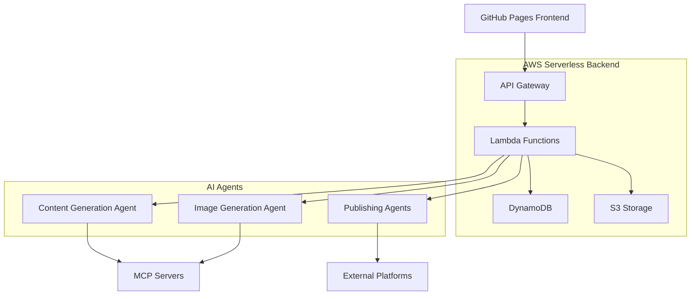

# Design Document

## Overview

The automated blog poster is designed as a serverless, agent-based system that transforms voice input into published blog posts with minimal user interaction. The architecture leverages GitHub Pages for the frontend, AWS serverless services for the backend, and specialized AI agents for content processing, image generation, and multi-platform publishing.

The system follows a mobile-first approach, optimizing for the core use case of speaking into a phone for 1-3 minutes and having that automatically become a published blog post across multiple platforms.

## Architecture

### High-Level Architecture



### Frontend Architecture (GitHub Pages)

- **Static Site Hosting**: GitHub Pages hosts the responsive web application
- **Progressive Web App (PWA)**: Enables mobile-first experience with offline capabilities
- **WebRTC/MediaRecorder API**: Handles voice recording directly in the browser
- **Responsive Design**: Optimized for both mobile and desktop with touch-friendly controls
- **Real-time Updates**: WebSocket connections for live status updates during processing

### Backend Architecture (AWS Serverless)

- **API Gateway**: RESTful API endpoints for frontend communication
- **Lambda Functions**: Serverless compute for orchestration and business logic
- **DynamoDB**: NoSQL database for storing drafts, history, and user preferences
- **S3**: Object storage for audio files, images, and static assets
- **EventBridge**: Event-driven communication between services and agents
- **SQS**: Message queuing for reliable agent communication
- **CloudWatch**: Monitoring and logging

## Components and Interfaces

### Frontend Components

#### Input Component
- **Primary**: Large, prominent voice recording button optimized for mobile
- **Secondary**: Text input area as alternative input method
- Real-time audio visualization during voice recording
- Automatic upload and processing initiation for both input types
- Progress indicators for each processing stage
- Seamless switching between voice and text input modes

#### Review Interface
- Mobile-responsive blog post preview
- Side-by-side content and image review
- Inline editing capabilities
- Feedback submission forms for agent revisions

#### Publishing Dashboard
- Platform selection interface
- Publishing status tracking
- History and draft management
- Platform authentication management

### Backend Services

#### Input Processing Service
```typescript
interface InputProcessingService {
  processAudio(audioFile: File): Promise<TranscriptionResult>
  processText(textInput: string): Promise<TextResult>
  validateAudioQuality(audioFile: File): Promise<ValidationResult>
  validateTextInput(textInput: string): Promise<ValidationResult>
}
```

#### Content Orchestration Service
```typescript
interface ContentOrchestrationService {
  initiateContentCreation(transcription: string, userId: string): Promise<string>
  handleAgentResponse(agentId: string, content: any): Promise<void>
  getContentStatus(contentId: string): Promise<ContentStatus>
}
```

#### Agent Communication Service
```typescript
interface AgentCommunicationService {
  sendToContentAgent(prompt: string, context: UserContext): Promise<string>
  sendToImageAgent(content: string, requirements: ImageRequirements): Promise<string>
  sendToPublishingAgent(content: BlogPost, platform: Platform): Promise<PublishResult>
}
```

### AI Agents

#### Content Generation Agent
- Receives either transcribed voice input or direct text input along with user context
- Generates complete blog posts using user's writing style
- Handles revision requests with specific feedback
- Maintains conversation history for context
- Adapts processing approach based on input type (voice vs text)

#### Image Generation Agent
- Analyzes blog content to determine image concepts
- Uses MCP servers to generate appropriate images
- Handles image revision requests
- Optimizes images for different platform requirements

#### Publishing Agents (Platform-Specific)
- **Medium Agent**: Formats content for Medium's API and publishing requirements
- **LinkedIn Agent**: Optimizes content for LinkedIn's professional format
- **Extensible Framework**: Plugin architecture for adding new platforms

## Data Models

### User Model
```typescript
interface User {
  id: string
  email: string
  writingStyleContext: string
  connectedPlatforms: PlatformConnection[]
  preferences: UserPreferences
  createdAt: Date
  updatedAt: Date
}
```

### Content Model
```typescript
interface BlogContent {
  id: string
  userId: string
  originalTranscription: string
  currentDraft: string
  associatedImage?: string
  status: ContentStatus
  revisionHistory: Revision[]
  publishingResults: PublishResult[]
  createdAt: Date
  updatedAt: Date
}
```

### Agent Communication Model
```typescript
interface AgentMessage {
  id: string
  contentId: string
  agentType: AgentType
  messageType: MessageType
  payload: any
  status: MessageStatus
  createdAt: Date
  processedAt?: Date
}
```

### Platform Connection Model
```typescript
interface PlatformConnection {
  platform: Platform
  credentials: EncryptedCredentials
  isActive: boolean
  lastUsed?: Date
  configuration: PlatformConfig
}
```

## Error Handling

### Frontend Error Handling
- **Network Failures**: Retry mechanisms with exponential backoff
- **Audio Recording Issues**: Fallback to text input with clear error messages
- **Session Timeouts**: Automatic re-authentication with state preservation
- **Offline Support**: Queue operations when offline, sync when reconnected

### Backend Error Handling
- **Agent Failures**: Automatic retry with different prompts or fallback to manual editing
- **Platform Publishing Failures**: Individual platform error reporting with retry options
- **Data Consistency**: Event sourcing pattern for reliable state management
- **Rate Limiting**: Graceful handling of API rate limits with user notification

### Agent Error Handling
- **Content Generation Failures**: Multiple prompt strategies and fallback options
- **Image Generation Failures**: Alternative image sources or user upload options
- **Publishing Failures**: Platform-specific error handling and retry logic

## Testing Strategy

### Frontend Testing
- **Unit Tests**: Component testing with Jest and React Testing Library
- **Integration Tests**: End-to-end user flows with Cypress
- **Mobile Testing**: Cross-device testing on various mobile browsers
- **Accessibility Testing**: WCAG compliance verification
- **Performance Testing**: Lighthouse audits for mobile performance

### Backend Testing
- **Unit Tests**: Lambda function testing with mocked dependencies
- **Integration Tests**: API Gateway and DynamoDB integration testing
- **Load Testing**: Serverless performance under various load conditions
- **Security Testing**: Authentication and authorization validation

### Agent Testing
- **Content Quality Tests**: Automated evaluation of generated content quality
- **Image Generation Tests**: Visual similarity and appropriateness testing
- **Publishing Tests**: Mock platform integrations for reliable testing
- **End-to-End Tests**: Complete workflow testing from voice input to publishing

### Deployment Testing
- **Infrastructure as Code**: CloudFormation/CDK templates with validation
- **Blue-Green Deployments**: Zero-downtime deployment strategy
- **Rollback Procedures**: Automated rollback on deployment failures
- **Monitoring**: Comprehensive alerting and health checks

## Security Considerations

### Authentication & Authorization
- **OAuth 2.0**: Secure authentication with major platforms
- **JWT Tokens**: Stateless authentication for API access
- **Role-Based Access**: User permissions and platform access control

### Data Protection
- **Encryption at Rest**: DynamoDB and S3 encryption
- **Encryption in Transit**: TLS for all API communications
- **Credential Management**: AWS Secrets Manager for platform credentials
- **Data Retention**: Configurable retention policies for user data

### Privacy
- **Audio Processing**: Temporary storage with automatic deletion
- **User Context**: Secure storage of writing style information
- **Platform Credentials**: Encrypted storage with minimal required permissions